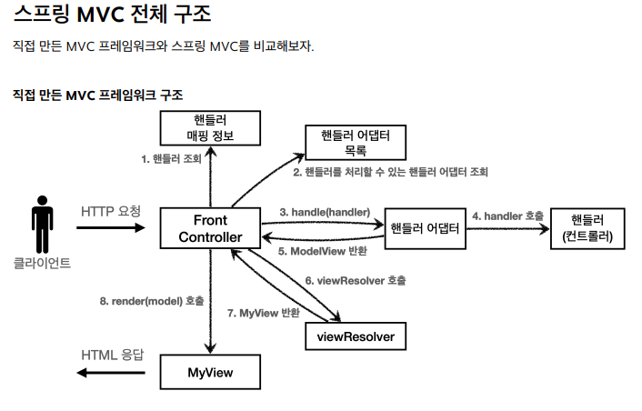
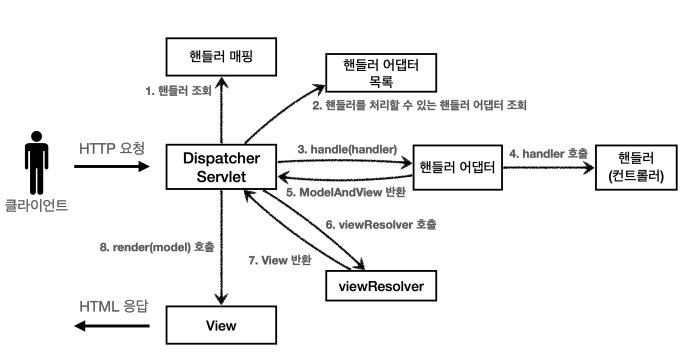
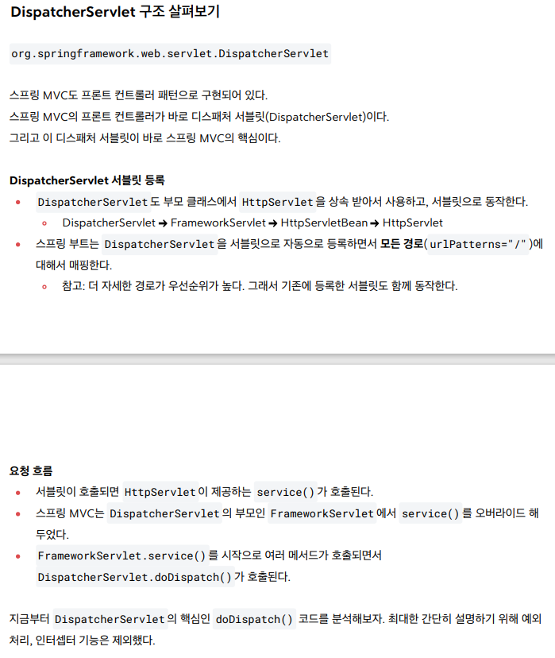
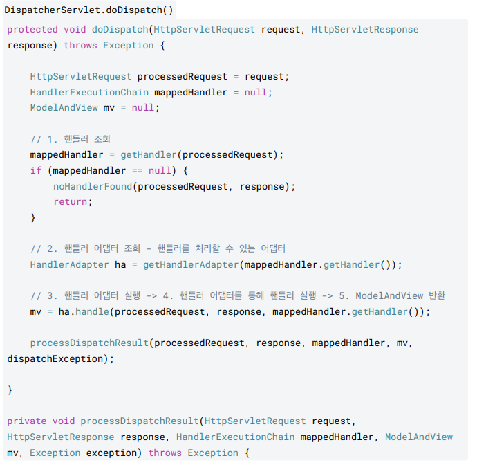
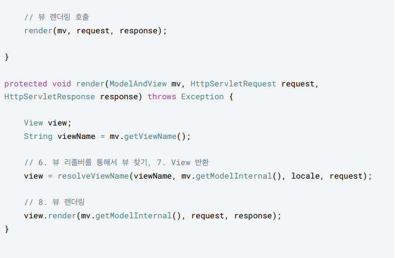
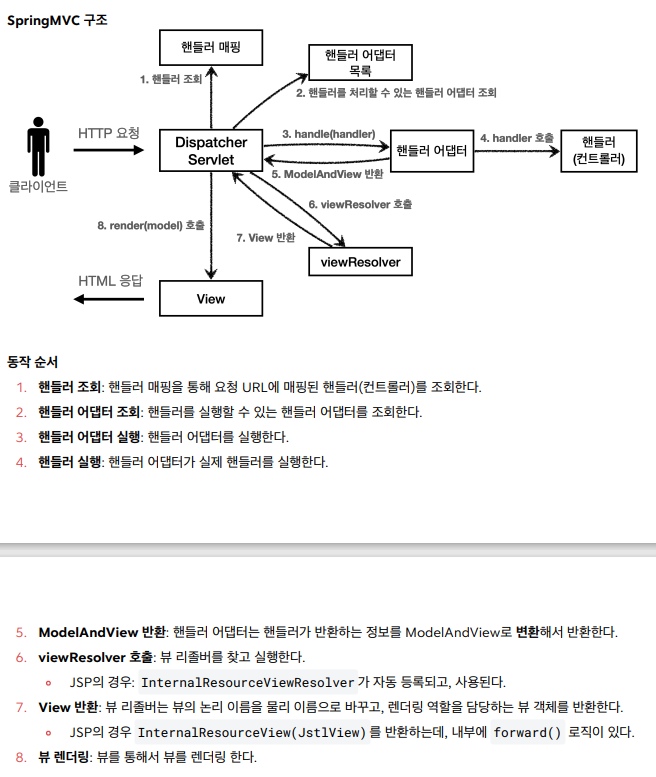
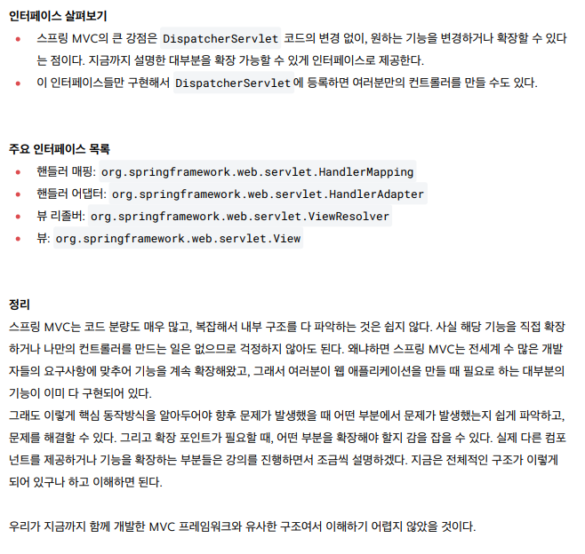

# 5. 스프링 MVC - 구조 이해

### 직접 만든 MVC FW

### Spring MVC FW

## 직접 만든 프레임워크 스프링 MVC 비교
- FrontController -> DispatcherServlet
- handlerMappingMap -> HandlerMapping
- MyHandlerAdapter -> HandlerAdapter
- ModelView -> ModelAndView
- viewResolver -> ViewResolver
- MyView -> View

---

## DispatcherServlet 구조 살펴보기

---

## Spring MVC 동작 순서

---

## 주요 인터페이스, 결론

